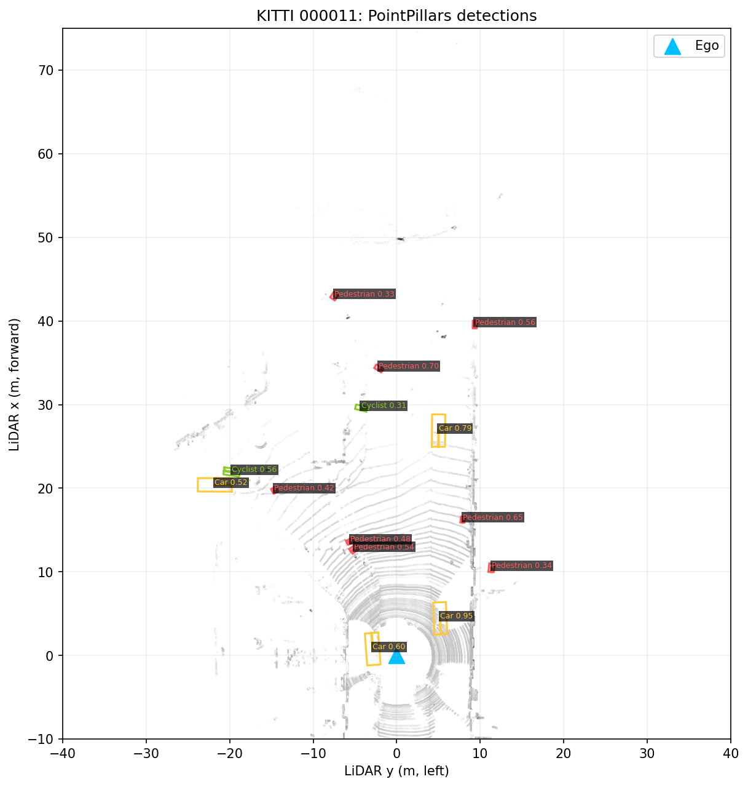
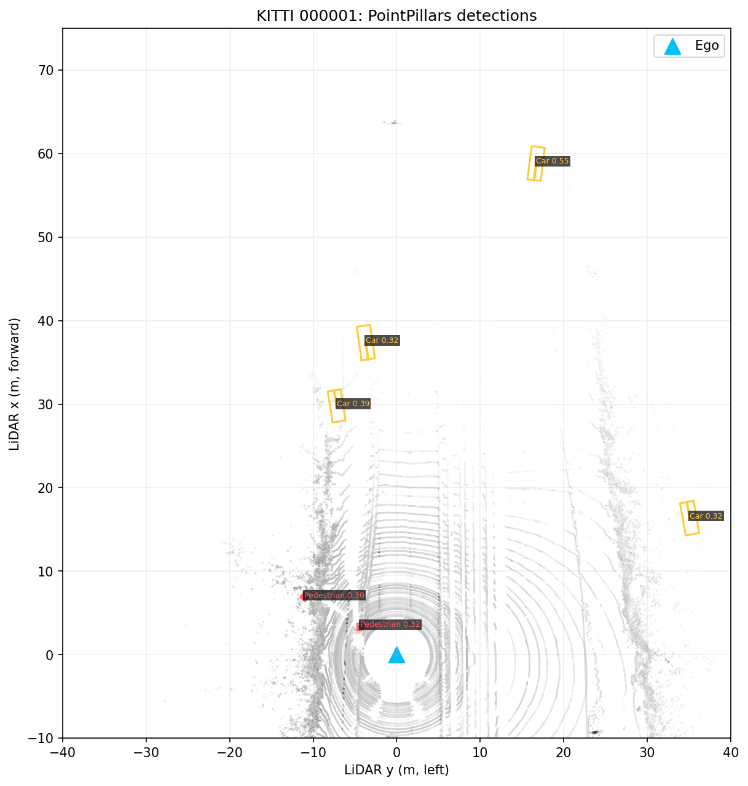
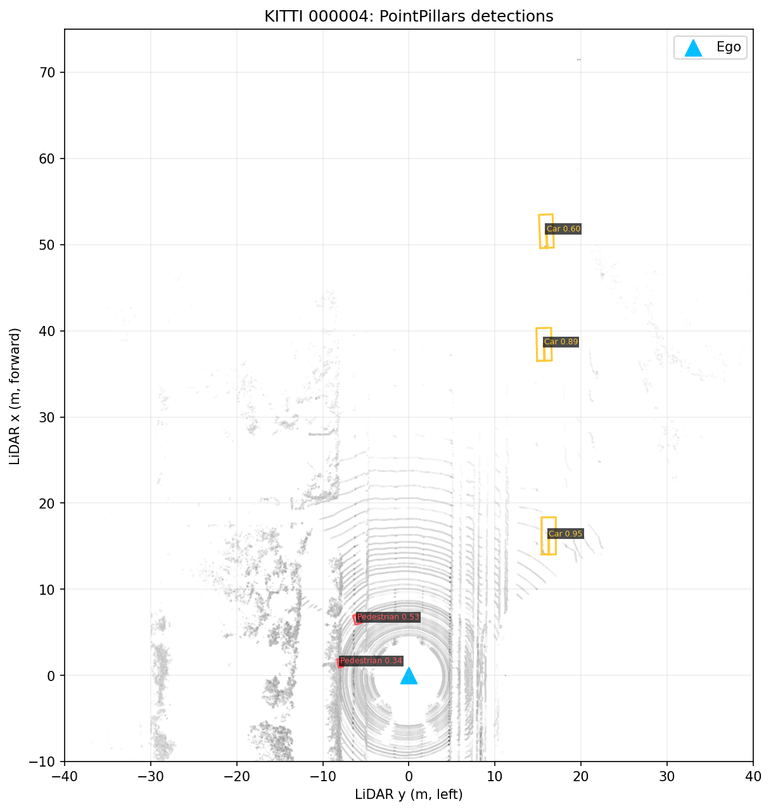
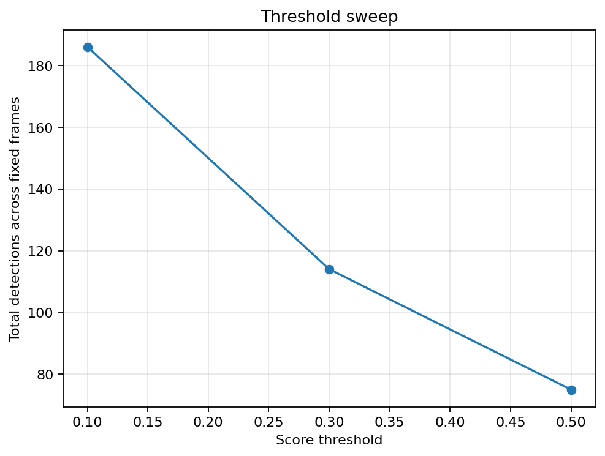
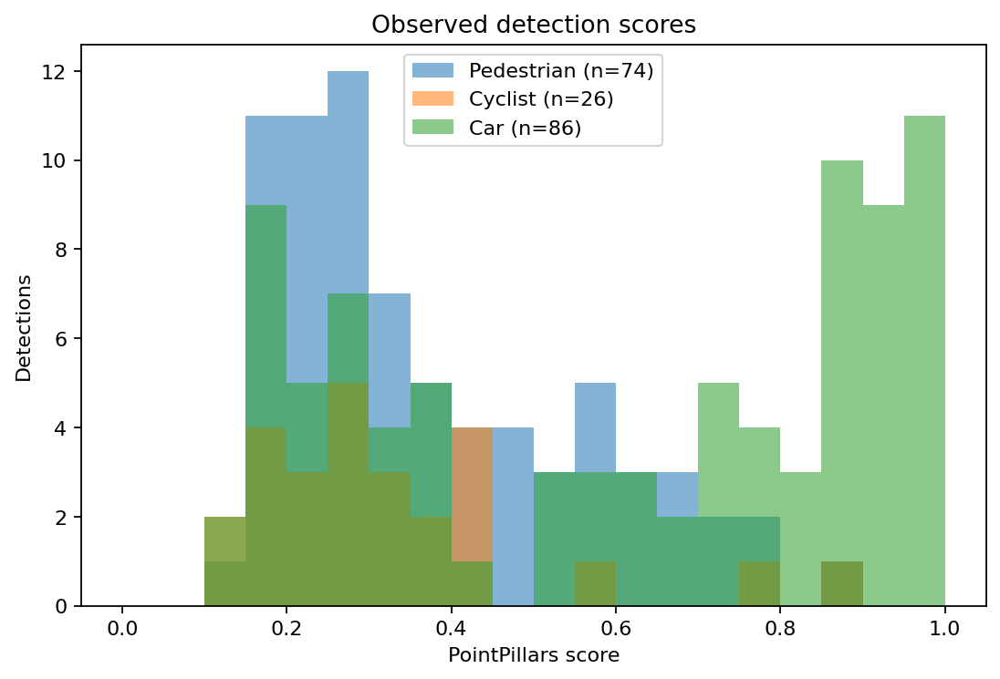
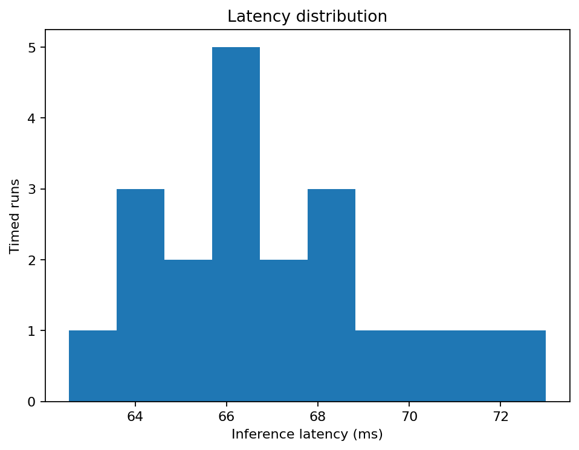
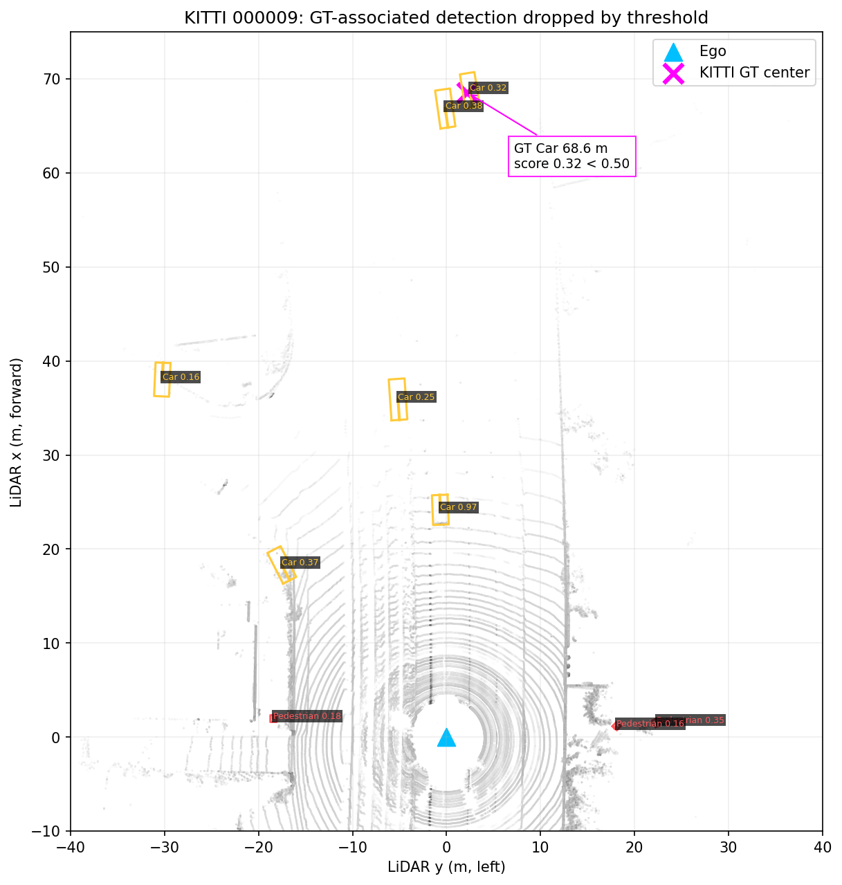

# Báo cáo Day 6: PointPillars KITTI baseline và score threshold

- **Họ tên:** Hà Mạnh Tuân
- **MSSV:** 2A202602982
- **Lớp:** VinUni AI20K — Track 4
- **Link repo:** https://github.com/tuanfptu/HaManhTuan-2A202602982-Track4-Day21
- **Topic:** B — Chạy baseline 3D detector
- **Dataset:** `data/kitti_mini` (KITTI Vision Benchmark Suite, dữ liệu của đề bài)
- **Các frame đã dùng:** 000011, 000015, 000001, 000007, 000008, 000010, 000004, 000009, 000012, 000016, 000049, 000019

## 1. Claim

Trên 12 frame KITTI mini cố định, tăng ngưỡng score của PointPillars từ 0,10 lên 0,50 làm số detection giảm từ 186 xuống 75 (**59,7%**). Pedestrian giảm 74,3% (74→19), Cyclist giảm 88,5% (26→3), còn Car giảm 38,4% (86→53). Đây là số box được xuất, **không phải precision/recall**. Một GT Car ở 68,6 m có detection score 0,322 tại ngưỡng thấp nhưng bị loại ở 0,50.

## 2. Evidence

Model là [PointPillars KITTI 3-class pretrained chính thức](https://github.com/open-mmlab/mmdetection3d/blob/v1.4.0/configs/pointpillars/metafile.yml), dùng MMDetection3D 1.4.0, MMDetection 3.3.0, MMCV 2.1.0, MMEngine 0.10.7, PyTorch 2.1.2+cu121. Checkpoint SHA256: `37dc242098f0d3dd7d870e0fe7cd4514f76fd85a04fb1377681279f963b3cbe5`. Batch 1 trên NVIDIA GeForce GTX 1660 Ti 6 GB (đã xác minh bằng `nvidia-smi` và PyTorch CUDA).

| Score threshold | Số frame | Tổng box | Car | Pedestrian | Cyclist |
|---:|---:|---:|---:|---:|---:|
| 0,10 | 12 | 186 | 86 | 74 | 26 |
| 0,30 | 12 | 114 | 63 | 39 | 12 |
| 0,50 | 12 | 75 | 53 | 19 | 3 |

Nguồn số: [`threshold_sweep.csv`](../results/threshold_sweep.csv), [`detection_results.csv`](../results/detection_results.csv). Các threshold 0,30/0,50 được lọc sau output NMS; config model có `score_thr=0.1`. Chỉ threshold xuất box thay đổi, cùng frame/model/checkpoint/hardware. Không retrain. Latency frame 000011: 3 warm-up, 20 lần inference, đồng bộ CUDA trước/sau; model load không tính, I/O + preprocess + model + postprocess có tính. Mean **66,95 ms**, p50 **66,47 ms**, p95 **71,04 ms**, min **62,55 ms**, max **73,00 ms**; xem [`latency.csv`](../results/latency.csv), [`benchmark_summary.json`](../results/benchmark_summary.json). Không đo latency riêng cho từng threshold vì sweep áp dụng postfilter lên cùng output model.

Config thực đọc từ file model: `point_cloud_range=[0,-39.68,-3,69.12,39.68,1]` m; `voxel_size=[0.16,0.16,4]` m; class order `Pedestrian,Cyclist,Car`; rotated NMS `nms_thr=0.01`, `nms_pre=100`, `max_num=50`. Test pipeline: LoadPointsFromFile → MultiScaleFlipAug3D (không flip, rot=0, scale=1, range filter) → Pack3DDetInputs. **single-frame KITTI PointPillars, no temporal multi-sweep aggregation**. Chi tiết config được export trong [`demo_000011.json`](../results/demo_000011.json) và [`benchmark_summary.json`](../results/benchmark_summary.json).













## 3. Failure case

Frame **000009**, KITTI GT **Car** ở **68,57 m** (không bị đánh dấu occluded). Dự đoán cùng class có tâm BEV cách tâm GT ≤2 m, score **0,322**: còn ở 0,10/0,30 và bị loại ở 0,50. Trong GT box chỉ đếm được **1 điểm LiDAR** từ frame gốc. Quy tắc matching là class-aware và tâm BEV ≤2 m; đây là proxy để minh họa, không phải IoU/AP. Toạ độ GT camera được đổi sang LiDAR bằng calibration gốc; GT box dùng kích thước/yaw từ `label_2`. Số liệu đầy đủ: [`failure_case.json`](../results/failure_case.json).



**Lớp debug:** Model (confidence và score postprocessing), có liên hệ với mật độ LiDAR đầu vào. Object rất xa, gần giới hạn x=69,12 m của config, và GT box chỉ chứa 1 điểm; điều đó phù hợp với giả thuyết biểu diễn pillar yếu làm confidence thấp. Dữ liệu này chưa chứng minh quan hệ nhân quả, và không đủ để kết luận detector hoàn toàn miss ở ngưỡng thấp. Khi debug thực tế: xem GT/calibration, đếm điểm trong GT box, kiểm tra output trước lọc và log score/range theo class.

## 4. Khuyến nghị nếu triển khai thật

Trong ADAS, threshold thấp giữ nhiều candidate hơn nhưng tăng output clutter và nguy cơ false positive; threshold cao giảm box xuất ra nhưng có thể loại vật xa/nhỏ như case trên. Không chọn threshold chỉ từ số box: cần tập validation lớn hơn, matching 3D/BEV IoU theo class, precision/recall và latency trong điều kiện vận hành. Pipeline hiện p95 khoảng 71 ms trên GTX 1660 Ti cho frame 000011, nhưng chưa đo tail latency trên workload dài hoặc nhiều tiến trình. Nên monitor score, range, class, mật độ điểm, detection rate và latency; production cần thêm tracking, sensor fusion và bằng chứng theo thời gian trước quyết định an toàn.

## 5. Cách chạy lại

Chạy PowerShell từ root repo trên Windows có `uv`, GPU NVIDIA và driver hỗ trợ CUDA 12.1. `src/setup_detector.py` tải checkpoint/config/wheel vào `external/` (Git ignore), kiểm tra SHA256; không thay đổi `.venv` của lab. Toàn bộ lệnh inference/benchmark/plot dưới đây đã chạy trên máy dùng để viết báo cáo. Hướng dẫn chi tiết: [`TOPIC_B_GUIDE.md`](../TOPIC_B_GUIDE.md).

```powershell
$env:UV_CACHE_DIR = (Join-Path (Get-Location) '.uv-cache')
$env:UV_PYTHON_INSTALL_DIR = (Join-Path (Get-Location) '.uv-python')
uv python install 3.10.20
uv venv .detector-venv --python .uv-python\cpython-3.10.20-windows-x86_64-none\python.exe
uv pip install --python .detector-venv\Scripts\python.exe torch==2.1.2 torchvision==0.16.2 --index-url https://download.pytorch.org/whl/cu121
.uv-python\cpython-3.10.20-windows-x86_64-none\python.exe src/setup_detector.py
uv pip install --python .detector-venv\Scripts\python.exe numpy==1.26.4 mmengine==0.10.7 mmdet==3.3.0 mmdet3d==1.4.0 matplotlib==3.10.7 .\external\mmcv-2.1.0-cp310-cp310-win_amd64.whl
.detector-venv\Scripts\python.exe tools/verify_data.py --data-root data/kitti_mini
.detector-venv\Scripts\python.exe src/detector_runner.py --frame 000011 --score-thr 0.10 --output results/demo_000011.json
.detector-venv\Scripts\python.exe src/benchmark_detector.py --runs 20 --warmup 3
.detector-venv\Scripts\python.exe src/visualize_bev.py --frames 000011,000001,000004,000008 --score-thr 0.30
.detector-venv\Scripts\python.exe src/analyze_results.py
.detector-venv\Scripts\python.exe tools/check_submission.py
```

Checkpoint nằm ngoài Git. Số latency thay đổi theo tải máy; số detection ổn định khi cùng checkpoint/config/dependency/data. Đây là 12 frame chọn lọc, chưa phải đánh giá KITTI test set.

## 6. Khai báo sử dụng AI

| Công cụ | Dùng cho việc gì | Kiểm chứng |
|---|---|---|
| OpenAI ChatGPT | Lập kế hoạch thí nghiệm, cấu trúc báo cáo, giải thích trade-off | Đối chiếu claim với CSV/JSON sinh từ code; không dùng số liệu hoặc ảnh do AI tạo |
| OpenAI Codex | Sinh và sửa code, debug môi trường MMEngine/Windows, tự động hoá benchmark và vẽ hình | Chạy inference trên KITTI thật, verify 80/80 file, chạy 12 frame/20 lần timing, kiểm tra CSV và trực quan ảnh BEV/failure, chạy submission checker |

Mọi số và hình trong báo cáo lấy từ checkpoint pretrained chạy thật trên dữ liệu KITTI mini; không train và không bịa kết quả.
